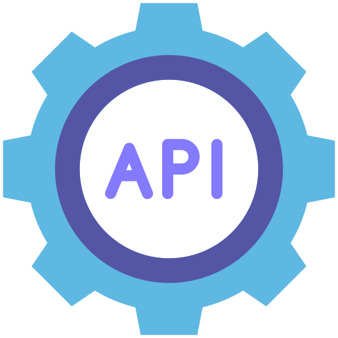

<h1 align="center">Hi 👋, I'm SeyyedMahdi Hassanpour</h1>

<h3 align="center">A passionate frontend developer 🤩😎</h3>

<ul>
  <li>🌱 I'm always <strong>learning & Teaching</strong></li>
  <li>🛡️ Using <strong>information security</strong> knowledge in coding </li>
 
  <li>🪄 A huge fan of auto code auditing, formatting, conventions etc... </li>
 
  <li>📝 See my <a href="https://marketplace.visualstudio.com/publishers/SeyyedKhandon" target="_blank">7 VScode Extensions for Better DX</a><small>developer experience</small>
  </li>

  <li>📓 Here is my <a href="https://www.youtube.com/watch?v=vu0vXQP_7m4&list=PLCkxtOXwj7xfBWp29Yq6UA_IB6zxuZhGm" target="_blank"> Webpack4 the RightWay</a>  Course on youtube
  </li>
  
  <li>📗 Here is my <a href="https://cafedx.com/product/stackoverflow-the-right-way-the-complete-guide-practical-reference" target="_blank"> StackOverflow the RightWay</a> course
  </li>
  
  <li>📺 Here is my Youtube Channel <a href="https://www.linkedin.com/in/seyyedkhandon" target="_blank">CafeDX</a>
  </li>
  
  <li>📫 Email: <a href="mailto:seyyedkhandon@gmail.com" target="_blank">seyyedkhandon@gmail.com</a>
</ul>

<h3 align="left">Connect with me:</h3>

  
  

<h3 align="left">Languages and Tools:</h3>

  
  
  
  
  
  
  
  
  
  
  
  
  
  
  

<h3 align="left">GitHub Stats:</h3>

  

  

