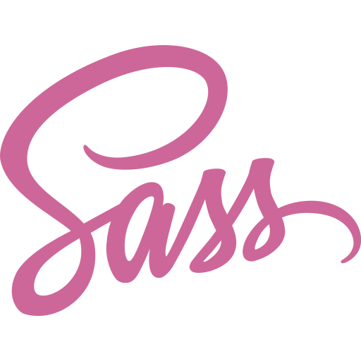
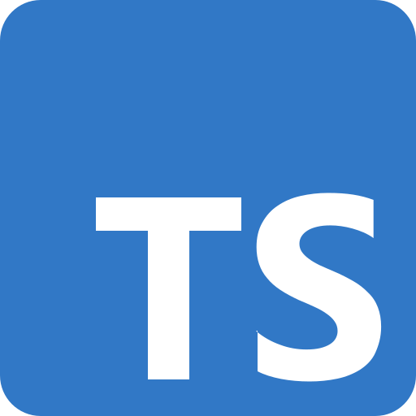
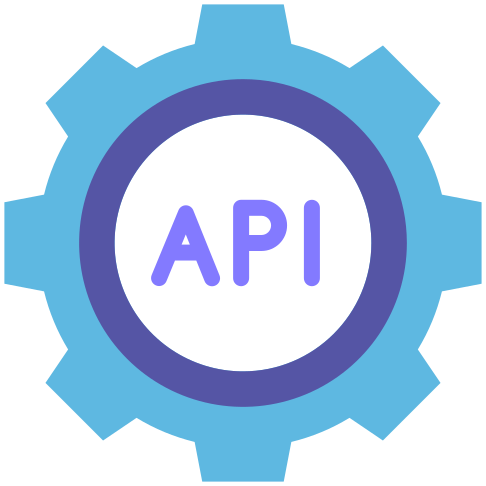
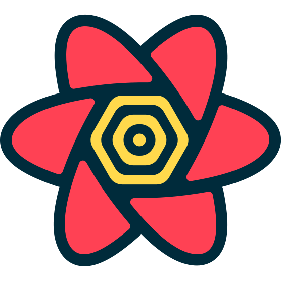
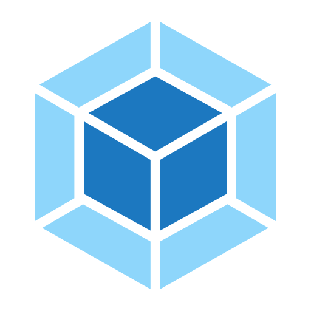
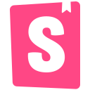
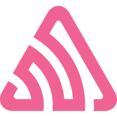
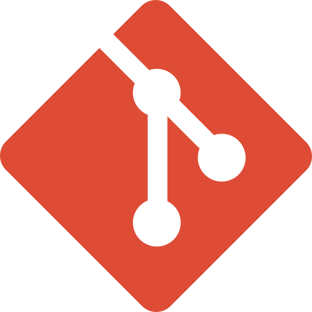

<!-- Generated by `npm run readme` from scripts/readme. Edit the generator, not this file. -->

  <picture><source media="(prefers-color-scheme: dark)" srcset="profile/hero-dark.svg" /></picture>

  <a href="https://github.com/SeyyedKhandon"><picture><source media="(prefers-color-scheme: dark)" srcset="profile/stats-dark.svg" /></picture></a>

  <a href="https://marketplace.visualstudio.com/publishers/SeyyedKhandon"><picture><source media="(prefers-color-scheme: dark)" srcset="profile/vscode-head-dark.svg" /></picture></a>
  <a href="https://marketplace.visualstudio.com/items?itemName=SeyyedKhandon.firacode"><picture><source media="(prefers-color-scheme: dark)" srcset="profile/vscode-firacode-dark.svg" /></picture></a>
  <a href="https://marketplace.visualstudio.com/items?itemName=SeyyedKhandon.fpack"><picture><source media="(prefers-color-scheme: dark)" srcset="profile/vscode-fpack-dark.svg" /></picture></a>
  <a href="https://marketplace.visualstudio.com/items?itemName=SeyyedKhandon.tpack"><picture><source media="(prefers-color-scheme: dark)" srcset="profile/vscode-tpack-dark.svg" /></picture></a>
  <a href="https://marketplace.visualstudio.com/items?itemName=SeyyedKhandon.gpack"><picture><source media="(prefers-color-scheme: dark)" srcset="profile/vscode-gpack-dark.svg" /></picture></a>
  <a href="https://marketplace.visualstudio.com/items?itemName=SeyyedKhandon.qpack"><picture><source media="(prefers-color-scheme: dark)" srcset="profile/vscode-qpack-dark.svg" /></picture></a>
  <a href="https://marketplace.visualstudio.com/items?itemName=SeyyedKhandon.epack"><picture><source media="(prefers-color-scheme: dark)" srcset="profile/vscode-epack-dark.svg" /></picture></a>
  <a href="https://marketplace.visualstudio.com/items?itemName=SeyyedKhandon.zpack"><picture><source media="(prefers-color-scheme: dark)" srcset="profile/vscode-zpack-dark.svg" /></picture></a>

  <picture><source media="(prefers-color-scheme: dark)" srcset="profile/chrome-head-dark.svg" /></picture>
  <a href="https://chromewebstore.google.com/detail/toolbox-for-amazon/fdebpchoageihbdifaiallkcipeooaoo"><picture><source media="(prefers-color-scheme: dark)" srcset="profile/chrome-0-dark.svg" /></picture></a>
  <a href="https://chromewebstore.google.com/detail/account-switcher-for-redd/dblhkalklfebjmlfmbdgacigmejcjggm"><picture><source media="(prefers-color-scheme: dark)" srcset="profile/chrome-1-dark.svg" /></picture></a>

  <picture><source media="(prefers-color-scheme: dark)" srcset="profile/tools-head-dark.svg" /></picture>
  <a href="https://github.com/SeyyedKhandon/bitcoin-js-solo-miner"><picture><source media="(prefers-color-scheme: dark)" srcset="profile/tool-0-dark.svg" /></picture></a>
  <a href="https://github.com/SeyyedKhandon/bavin"><picture><source media="(prefers-color-scheme: dark)" srcset="profile/tool-1-dark.svg" /></picture></a>
  <a href="https://www.softpedia.com/publisher/Seyed-MAhdi-HassanPour-MatiKolaei-85894.html"><picture><source media="(prefers-color-scheme: dark)" srcset="profile/softpedia-dark.svg" /></picture></a>

  <picture><source media="(prefers-color-scheme: dark)" srcset="profile/learn-head-dark.svg" /></picture>
  <a href="https://github.com/SeyyedKhandon/coach"><picture><source media="(prefers-color-scheme: dark)" srcset="profile/learn-0-dark.svg" /></picture></a>
  <a href="https://seyyedkhandon.github.io/stackoverflow-the-right-way/"><picture><source media="(prefers-color-scheme: dark)" srcset="profile/learn-1-dark.svg" /></picture></a>
  <a href="https://www.youtube.com/watch?v=vu0vXQP_7m4&amp;list=PLCkxtOXwj7xfBWp29Yq6UA_IB6zxuZhGm"><picture><source media="(prefers-color-scheme: dark)" srcset="profile/learn-2-dark.svg" /></picture></a>
  <a href="https://adplist.org/mentors/seyyed-mahdi-hassanpour"><picture><source media="(prefers-color-scheme: dark)" srcset="profile/mentoring-dark.svg" /></picture></a>

  <a href="https://www.linkedin.com/in/seyyedkhandon"><picture><source media="(prefers-color-scheme: dark)" srcset="profile/work-dark.svg" /></picture></a>

  <picture><source media="(prefers-color-scheme: dark)" srcset="profile/contact-dark.svg" /></picture>

📫 [seyyedkhandon.en@gmail.com](mailto:seyyedkhandon.en@gmail.com) · [LinkedIn](https://www.linkedin.com/in/seyyedkhandon) · [GitHub](https://github.com/SeyyedKhandon) · [Stack Overflow](https://stackoverflow.com/users/12666332/seyyedkhandon) · [YouTube](https://www.youtube.com/c/cafedx_com) · [VS Code Marketplace](https://marketplace.visualstudio.com/publishers/SeyyedKhandon) · [ADPList](https://adplist.org/mentors/seyyed-mahdi-hassanpour)

<h3 align="left">Languages and Tools:</h3>

  
  
  
  
  
  
  
  
  
  
  
  
  
  
  

The panels above are SVGs generated by `npm run readme`; the stats refresh daily. The source of my portfolio site lives here too: see [DEVELOPMENT.md](DEVELOPMENT.md).
